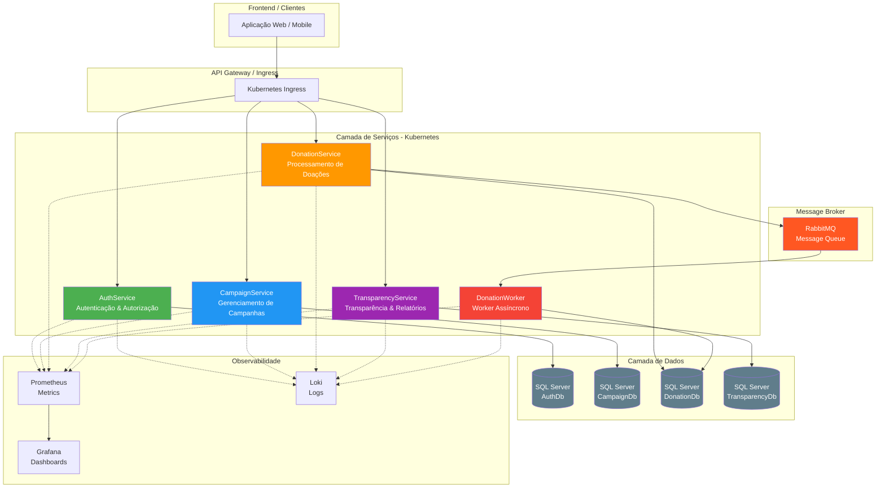
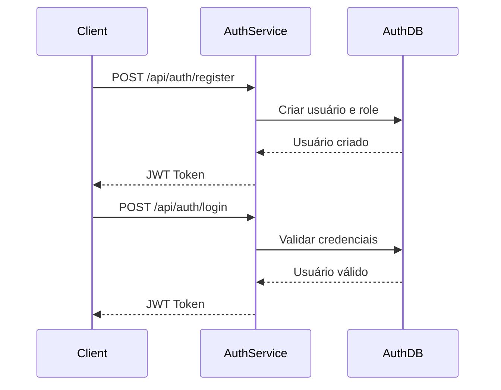
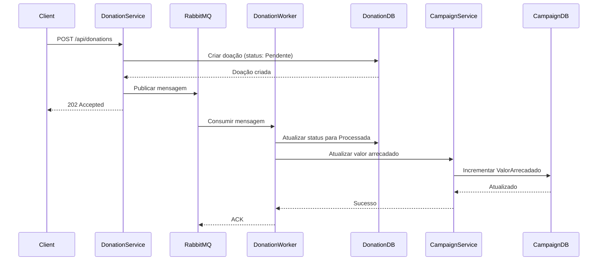

# Diagrama de Arquitetura - Conexão Solidária

## Visão Geral da Arquitetura



## Fluxo de Dados

### Fluxo de Autenticação


### Fluxo de Doação


## Componentes da Arquitetura

### Microserviços

1. **AuthService**
   - Responsabilidade: Autenticação e autorização
   - Tecnologias: ASP.NET Core, JWT, Identity, EF Core
   - Banco: AuthDb (SQL Server)
   - Endpoints: Login, Register, Health

2. **CampaignService**
   - Responsabilidade: Gerenciamento de campanhas de doação
   - Tecnologias: ASP.NET Core, EF Core, RabbitMQ
   - Banco: CampaignDb (SQL Server)
   - Endpoints: CRUD Campanhas, Health

3. **DonationService**
   - Responsabilidade: Processamento de doações
   - Tecnologias: ASP.NET Core, EF Core, RabbitMQ
   - Banco: DonationDb (SQL Server)
   - Endpoints: Criar doação, Health

4. **TransparencyService**
   - Responsabilidade: Relatórios de transparência
   - Tecnologias: ASP.NET Core, EF Core, JWT
   - Banco: TransparencyDb (SQL Server)
   - Endpoints: Consultar campanhas, Health

5. **DonationWorker**
   - Responsabilidade: Processamento assíncrono de doações
   - Tecnologias: .NET Worker Service, RabbitMQ, EF Core
   - Banco: DonationDb (SQL Server)
   - Função: Consumir mensagens do RabbitMQ e atualizar status

### Infraestrutura

- **Kubernetes**: Orquestração de containers
- **RabbitMQ**: Message broker para comunicação assíncrona
- **SQL Server**: Banco de dados relacional
- **Prometheus**: Coleta de métricas
- **Grafana**: Visualização de métricas
- **Serilog**: Logging estruturado

## Padrões Arquiteturais Utilizados

1. **Microserviços**: Cada serviço tem responsabilidade única
2. **Message Queue**: Desacoplamento via RabbitMQ
3. **Database per Service**: Cada serviço tem seu próprio banco
4. **API Gateway**: Ingress do Kubernetes como gateway
5. **Health Checks**: Monitoramento de saúde dos serviços
6. **Observabilidade**: Logs, métricas e tracing

## Deploy

### Local (Docker Compose)
```bash
docker-compose up -d
```

### Kubernetes
```bash
kubectl apply -f k8s/
```

## Portas e Endpoints

| Serviço | Porta Interna | Porta Externa | Health Check |
|---------|---------------|---------------|--------------|
| AuthService | 8080 | 30001 | /api/health |
| CampaignService | 8080 | 30002 | /api/health |
| DonationService | 8080 | 30003 | /api/health |
| TransparencyService | 8080 | 30004 | /api/health |
| RabbitMQ | 5672/15672 | 30005/30006 | - |
| SQL Server | 1433 | 30007 | - |
